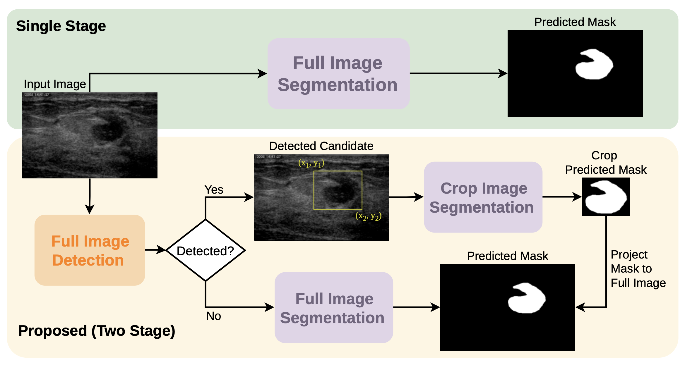

# Coarse-to-Fine Breast Lesion Segmentation in Ultrasound Images: A Detection-Guided Two-Stage Framework

Official implementation of the paper:
"Coarse-to-Fine Breast Lesion Segmentation in Ultrasound Images: A Detection-Guided Two-Stage Framework"

**Authors:**
- [Mrs. Aamal Alghamdi, University of Strathclyde](https://pureportal.strath.ac.uk/en/persons/aamal-mohammed-s-alghamdi/)
- [Dr. Mohamed Elawady, University of Strathclyde](https://pureportal.strath.ac.uk/en/persons/mohamed-elawady/)

**Conference:** 30th Conference on Medical Image Understanding and Analysis, 20th - 22nd July 2026 (MIUA 2026)

## Overview


## Datasets
- [UDIAT (aka Breast Ultrasound Dataset B)](https://helward.mmu.ac.uk/STAFF/M.Yap/dataset.php): The dataset was originally developed by the Computer Vision and Robotics Research Group (ViCOROB) at the University of Girona.
- [BUSI](https://doi.org/10.1016/j.dib.2019.104863)
- [BUSBRA](https://zenodo.org/records/8231412)

## Installation

```bash
git clone https://github.com/mawady/miua26.git
cd miua26
uv venv --python 3.10
source .venv/bin/activate
uv pip install -r requirements.txt
```
